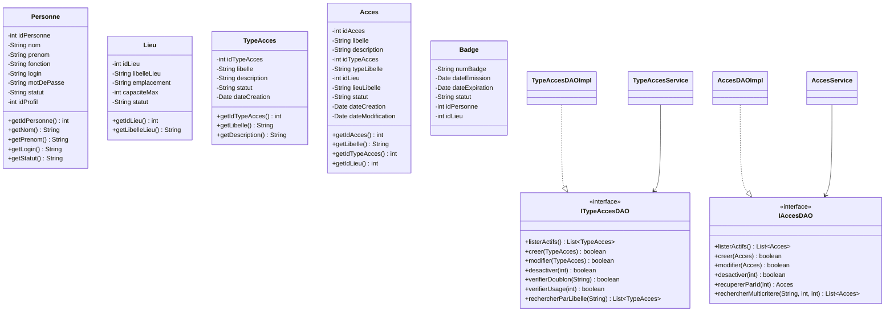
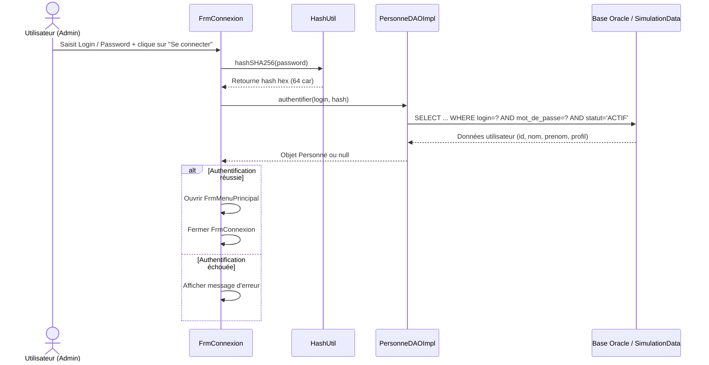
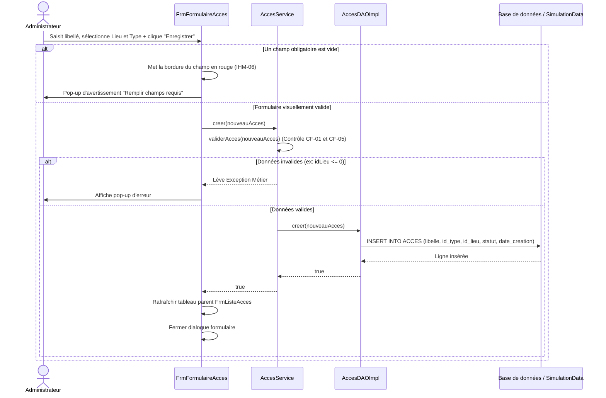
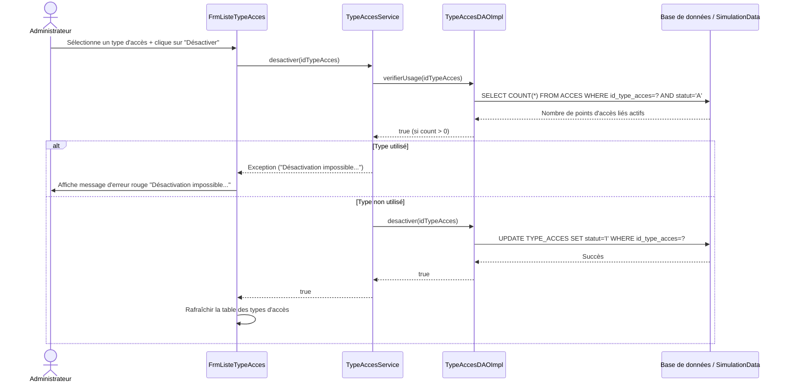
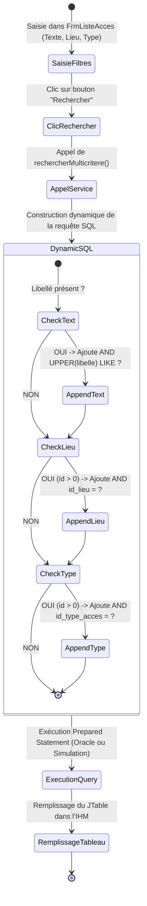

# DOSSIER DE CONCEPTION DÉTAILLÉE (DCD)
**Système :** Système de Gestion d'Accès (SGA) — Lot 1 : Gestion des Accès  
**Phase :** Phase 2 — Conception détaillée et Codage  
**Binôme rédacteur :** Binôme 2 (Phase 2)  

---

## 1. Architecture Logicielle (3-Tiers)
L'application SGA Lot 1 est structurée selon une architecture 3-tiers découplée :

```
┌────────────────────────────────────────────────────────┐
│                   Couche 1 : IHM                      │
│   (sga.ihm - FrmConnexion, FrmListeAcces, etc.)       │
└──────────────────────────┬─────────────────────────────┘
                           │ Appels de services
                           ▼
┌────────────────────────────────────────────────────────┐
│                 Couche 2 : Service                     │
│    (sga.service - TypeAccesService, AccesService)      │
└──────────────────────────┬─────────────────────────────┘
                           │ Appels DAO (Interfaces)
                           ▼
┌────────────────────────────────────────────────────────┐
│                   Couche 3 : DAO                       │
│    (sga.dao - ITypeAccesDAO, IAccesDAO, JDBC/Simu)     │
└────────────────────────────────────────────────────────┘
```

---

## 2. Diagramme de Classes Complet
Voici le diagramme UML des classes métiers et d'accès aux données implémentées pour le Lot 1 :



---

## 3. Diagrammes de Séquence des Scénarios Clés

### 3.1 Connexion Utilisateur (SHA-256 local et validation Oracle)


### 3.2 Ajout d'un point d'accès avec validations métier (CF-01, CF-05)


### 3.3 Désactivation logique d'un Type d'Accès avec blocage de sécurité (CF-04)


---

## 4. Diagrammes d'Activité

### 4.1 Recherche Multicritère des Points d'Accès


---

## 5. Justifications de Conception Technique (Questions de Soutenance)

### 5.1 Choix des Formes Normales (3FN)
Les tables `PERSONNE`, `LIEU`, `TYPE_ACCES`, `ACCES` et `BADGE` sont en 3ème Forme Normale (3FN) :
1.  **1FN (Atomicité des attributs) :** Chaque champ contient une valeur atomique (ex: nom, prenom, libelle sont uniques et non décomposables).
2.  **2FN (Dépendance fonctionnelle complète) :** Toutes les colonnes non clés dépendent entièrement de la clé primaire de leur table. Par exemple, la description d'un type d'accès dépend uniquement de `id_type_acces`.
3.  **3FN (Absence de dépendance transitive) :** Aucun attribut non clé ne dépend d'un autre attribut non clé. Le lieu de l'accès n'est pas stocké dans la table `ACCES` directement sous forme de libellé/adresse, mais via une référence `id_lieu`. Toute modification de la capacité ou de l'adresse d'un lieu n'impacte donc pas la table `ACCES`.

### 5.2 Pourquoi un Trigger plutôt qu'un CHECK pour `date_modification` ?
Une contrainte `CHECK` sert uniquement à valider qu'une donnée respecte une condition logique (ex: `statut IN ('A', 'I')`). Elle ne permet pas de modifier la valeur d'une colonne.
Le trigger `TRG_ACCES_MODIF` est un déclencheur événementiel `BEFORE UPDATE ON ACCES`. Il intercepte la transaction d'écriture sur Oracle pour injecter la date actuelle (`SYSDATE`) dans la colonne `date_modification` de manière automatique. Cela assure le respect de la règle **CF-06** de façon centralisée au niveau de la BDD, quel que soit l'outil client (Java, SQL Developer, script externe).

### 5.3 Flux de Connexion Sécurisée
1.  **Saisie :** L'utilisateur entre son mot de passe en clair dans un `JPasswordField` Swing.
2.  **Hachage Client :** Dès la soumission, l'application exécute localement `HashUtil.hashSHA256(password)`. Le mot de passe en clair est immédiatement détruit en mémoire.
3.  **Requête SQL Paramétrée :** L'application envoie uniquement le hash hexadécimal à Oracle dans une requête JDBC préparée (`PreparedStatement`) :
    `SELECT ... WHERE login=? AND mot_de_passe=? AND statut='ACTIF'`
4.  **Avantage :** Le mot de passe en clair ne circule jamais sur le réseau et n'est jamais visible en base de données.
